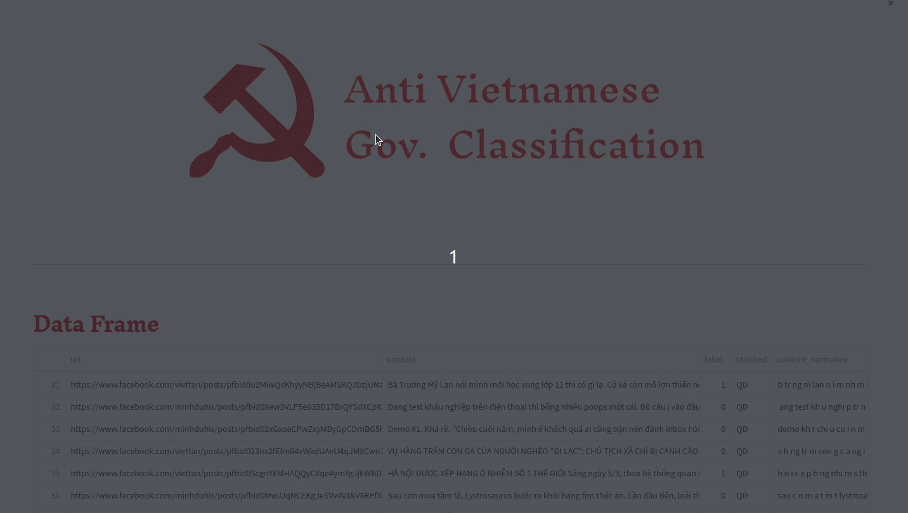
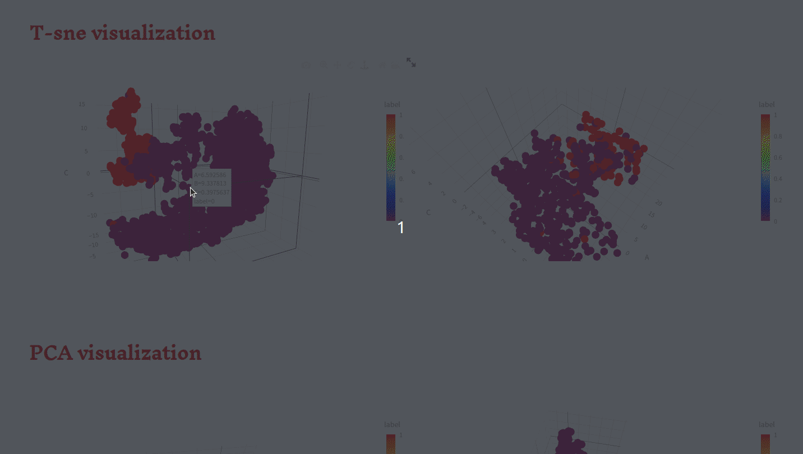

  

## Overview
The rebellious post classifier is built using deep learning techniques, specifically recurrent neural network (RNN) architectures such as GRU (Gated Recurrent Unit) and LSTM (Long Short-Term Memory). It takes as input text content, and predicts the rebellious level of the post. The classifier can identify whether posts are rebellious or not.
  
This repository contains code for a rebellious post classifier, a machine learning model designed to classify posts into different categories based on their toxicity levels. The classifier can be used to automatically detect and filter out rebellious posts, helping to create safer online communities.

## Dependencies
The rebellious post classifier requires the following dependencies:
- Python 3.x
- NumPy
- Pandas
- Torch
- NLTK (Natural Language Toolkit)
- Streamlit

## Key Features
* Custom layout
  - With this feature, users cantailor their dashboard experience according to their unique preferences and priorities.
* Data Statistics
  - Users can use the sidebar to plot any type of charts to visualize data statistics.
  
* Demo of the best GRU Model with an Input
  - Experience the power of our cutting-edge GRU (Gated Recurrent Unit) model firsthand with our interactive demo feature. Our GRU model is meticulously trained on vast datasets to provide accurate and insightful classifications, enabling users to gain valuable insights from their text inputs.
  - After inputting their text, users simply press the "Predict" button, initiating our GRU model's classification process.
  - The output includes not only the predicted classification (rebellious or not) but also a corresponding probability score, providing users with valuable insights into the model's confidence level.
  
* 3D Visualization with T-SNE and PCA 
  - Immerse yourself in an interactive 3D environment, where each data point is represented as a distinct marker in the visual space.
  - Users can navigate freely through the visualization, zooming in on specific clusters or regions of interest for closer examination, examining each clusters.
  

## Meet the Team
- Nguyễn Quý Đang - 22022500 - UET
- Nguyễn Nhật Minh - 22022503 - UET
- Đỗ Minh Nhật - 22022537 - UET
- Vũ Vân Long - 22022501 - UET
